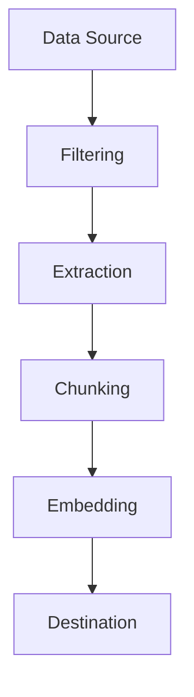
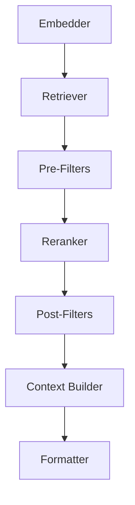
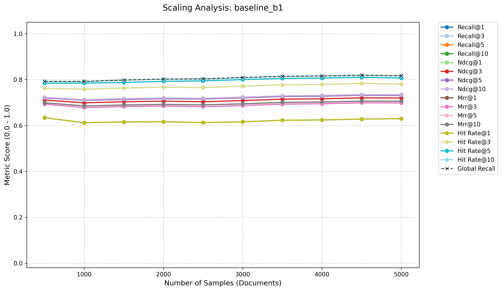

<p align="center">
  
</p>

<p align="center">
  
  
  
</p>

<p align="center">
  <a href="Readme.md">English</a> | <b>Deutsch</b>
</p>

---

**Modularis RAG** ist ein hochmodulares Framework zur Entwicklung, Optimierung und Evaluierung von Retrieval-Augmented Generation (RAG) Systemen. Es ermöglicht die nahtlose Kombination verschiedenster Ingestion- und Retrieval-Strategien durch eine deklarative JSON-Konfiguration, wobei ein besonderer Fokus auf Datenbereinigung und industrietaugliche Robustheit gelegt wird.

---

### 🗺️ Navigation
*   [📦 Installation](#-installation)
*   [⚡ Quick Start](#-quick-start)
*   [⚙️ Ingestion Pipeline](#️-ingestion-pipeline)
*   [🔍 Retrieval Pipeline](#-retrieval-pipeline)
*   [🛠️ Erweiterbarkeit & Custom Module](#️-erweiterbarkeit--custom-module)
*   [📊 Evaluation](#-evaluation)
*   [📈 Evaluation Dashboard](#-evaluation-dashboard)
*   [🛤️ Roadmap](#️-roadmap)
*   [⚖️ Lizenz](#️-lizenz)

--- 

### 📦 Installation
Modularis RAG erfordert Python 3.11+ oder höher. Am einfachsten lässt sich das Framework mit Docker starten, da alle Datenbank-Erweiterungen (pgvector, pg_search) und Modelle bereits vorkonfiguriert sind.

#### Option A: Schnellstart mit Docker (Empfohlen)
Diese Variante startet PostgreSQL (ParadeDB), Ollama und eine fertige Python-Umgebung.

1.  **Voraussetzung:** [Docker Desktop](https://www.docker.com/products/docker-desktop/) (oder Docker Engine + Compose) und [Ollama](https://ollama.com/) (optional, falls lokal genutzt).

2.  **Container starten:**

    ```bash
    docker-compose -f docker/docker-compose.yml up -d
    ```
    *Dies lädt automatisch das `nomic-embed-text-v2-moe` Modell herunter (kann einige Minuten dauern).*
3.  **In den App-Container wechseln:**

    ```bash
    docker-compose -f docker/docker-compose.yml exec app bash
    ```
4.  **Demo ausführen (Ingestion von 10 GoogleNQ Dokumenten):**

    ```bash
    python -m rag_pipeline.ingestion.main --config docker/docker_pipeline_config.json
    ```
5.  **Demo ausführen (Retrieval Test):**

    ```bash
    python -m rag_pipeline.retrieval.main --config docker/docker_retrieval_config.json
    ```

#### Option B: Manuelle Installation
Wähle diese Option, wenn du mehr als nur einen kurzen Test des Frameworks durchführen möchtest.

1.  **System-Anforderungen (PostgreSQL & Ollama):**
    *   **PostgreSQL:** Version 16+ empfohlen.
    *   **Erweiterungen:** Du musst [pgvector](https://github.com/pgvector/pgvector) und [pg_search](https://github.com/paradedb/paradedb) (ParadeDB) installieren.
    *   **Ollama:** Installiere Ollama von [ollama.com](https://ollama.com).

    *   **Linux (Ubuntu/Debian):**
        ```bash
        # PostgreSQL & pgvector
        sudo apt update && sudo apt install postgresql-16 postgresql-16-pgvector
        # pg_search Installation (siehe paradedb.com für Details)
        ```
2.  **Repository klonen:**

    ```bash
    git clone https://github.com/Christof404/modularis-rag
    cd modularis-rag
    ```
3.  **Virtuelle Umgebung & Abhängigkeiten:**

    ```bash
    python3 -m venv .venv
    source .venv/bin/activate
    pip install -r requirements.txt
    ```


---
### ⚡ Quick Start
Der effizienteste Weg, eigene Pipelines zu erstellen, ist der interaktive **Pipeline Builder**. 
Weitere Beispiel Pipeline JSON Konfigurationen können hier: [https://ragevaluationvisualizer.fly.dev/](https://ragevaluationvisualizer.fly.dev/) gefunden werden.

https://github.com/user-attachments/assets/f4ec4c3d-1ae7-4b5a-b02a-9a53a00a0825

<details>
<summary>Beispiel: Baseline Indexing Pipeline</summary>

```json
{
    "source": {
        "component_name": "GoogleNQSource",
        "params": {
            "num_samples": 5000,
            "split": "validation"
        }
    },
    "converter": {
        "component_name": "HTMLToMarkdownConverter",
        "params": {
            "filters": [
                {
                    "component_name": "UniversalHtmlFilter",
                    "params": {
                        "apply_to": "page_content",
                        "css_selector": ".mw-parser-output"
                    }
                }
            ]
        }
    },
    "filters": [],
    "chunkers": [
        {
            "component_name": "HuggingFaceTokenChunker",
            "params": {
                "model_name": "nomic-ai/nomic-embed-text-v2-moe",
                "chunk_size": 500,
                "chunk_overlap": 50,
                "filters": [],
                "extractors": [],
                "target_content_types": null
            }
        }
    ],
    "embedder": {
        "component_name": "OllamaEmbedder",
        "params": {
            "model_name": "nomic-embed-text-v2-moe",
            "model_dimension": 768,
            "batch_size": 64,
            "prefix_prompt": "search_document:"
        }
    },
    "writer": {
        "component_name": "PostgresWriter",
        "params": {
            "dsn": "postgresql://postgres:@localhost:5432/google_nq",
            "table_name": "baseline_b1",
            "vector_dimension": 768
        }
    }
}
```
</details>

<details>
<summary>Beispiel: Base Retrieval Pipeline</summary>

```json
{
    "embedder": {
        "component_name": "OllamaEmbedder",
        "params": {
            "model_name": "nomic-embed-text-v2-moe",
            "model_dimension": 768,
            "max_tokens": 512,
            "batch_size": 64,
            "prefix_prompt": "search_query:"
        }
    },
    "retriever": {
        "component_name": "PostgresVectorRetriever",
        "params": {
            "dsn": "postgresql://postgres:@localhost:5432/google_nq",
            "table_name": "baseline_b1"
        }
    },
    "pre_filters": [],
    "reranker": {
        "component_name": "CrossEncoderReranker",
        "params": {
            "model_name": "cross-encoder/ms-marco-MiniLM-L-6-v2",
            "max_length": 512
        }
    },
    "post_filters": [
        {
            "component_name": "TopKFilter",
            "params": {
                "top_k": 10
            }
        }
    ],
    "context_builder": {
        "component_name": "GroupedContextBuilder",
        "params": {
            "max_chars": 12000
        }
    },
    "formatter": {
        "component_name": "DefaultResponseFormatter",
        "params": {}
    }
}
```
</details>

#### Pipelines erstellen
Führe das jeweilige `main_builder` Skript aus, um Schritt für Schritt durch die Konfiguration geführt zu werden.

*   **Ingestion Pipeline erstellen:**

    ```bash
    python -m rag_pipeline.ingestion.main_builder --config_save_path "pipeline_config.json"
    ```
*   **Retrieval Pipeline erstellen:**

    ```bash
    python -m rag_pipeline.retrieval.main_builder --config_save_path "pipeline_config.json"
    ```

#### Pipeline starten
Starte die gewünschte Pipeline durch Angabe des Pfades zur zuvor erzeugten JSON Konfiguration.

*   **Ingestion Pipeline ausführen:**

    ```bash
    python -m rag_pipeline.ingestion.main --config "pipeline_config.json"
    ```
*   **Retrieval Pipeline ausführen:**

    ```bash
    python -m rag_pipeline.retrieval.main --config "pipeline_config.json"
    ```

---

### ⚙️ Ingestion Pipeline
Das Framework bietet zwei Ansätze: 
- Die deklarative Nutzung über JSON (empfohlen für Reproduzierbarkeit) oder
- die direkte programmgesteuerte Einbindung der Klassen.

#### 1. Funktionsweise
Eine saubere Indexierung der Daten ist essenziell für die spätere Retrieval-Qualität. Es ist entscheidend, Daten strukturell präzise zu trennen, um Kontextabbrüche und Rauschen durch irrelevante Informationen zu minimieren. Da Datensätze, insbesondere im Unternehmensumfeld, stark variieren, bietet das Framework keine starre Universallösung, sondern modulare Bausteine.

#### 2. Konfiguration des JSON-Schemas
Durch Ausführen des Moduls `main_builder.py` kann die Pipeline interaktiv konfiguriert werden. Der Aufbau folgt einem standardisierten Prozess, bleibt jedoch durch die austauschbaren Module maximal flexibel.

```bash
python -m rag_pipeline.ingestion.main_builder
```

Der Terminal-Assistent führt durch den folgenden Workflow der Indexierung:



**Best Practice:** Identische Eingabedaten sollten in dieselbe Datenbank fließen. Dies erleichtert die spätere Evaluation verschiedener Indexierungsmethoden. 
Jede Strategie (Pipeline) erhält eine eigene Tabelle in der Datenbank (z. B. `baseline_b1`), die automatisch erstellt oder erweitert wird. Es muss sichergestellt werden, dass der Datenbank-User über die notwendigen Rechte zum Anlegen von Tabellen verfügt. 
So können verschiedene Strategien unabhängig voneinander evaluiert und die performanteste Lösung für die gegebenen Daten identifiziert werden.

#### 3. Video-Guide: Pipeline-Erstellung

https://github.com/user-attachments/assets/cff0c3be-987b-4902-b5a7-d6128dffd3c3

#### 4. Programmatische Nutzung (JSON)
Das generierte JSON-Schema kann direkt in Python geladen und ausgeführt werden:

```python
from rag_pipeline.ingestion.pipeline import IngestPipeline
from rag_pipeline.core.registry import ComponentRegistry
from rag_pipeline.ingestion.registry import REGISTRY
from rag_pipeline.core.factory import Factory
import json

with open("pipeline_config.json", "r") as f:
    config_dict = json.load(f)
    
registry = ComponentRegistry(REGISTRY)
ingest_factory = Factory(registry)
components_dict = {key: ingest_factory.instantiate_from_config(val) for key, val in config_dict.items()}

pipeline = IngestPipeline(**components_dict)
pipeline.run()
```

#### 5. Ausführung über die CLI

```bash
python -m rag_pipeline.ingestion.main --config "pipeline_config.json"
```

Während der Ausführung wird die Performance jedes Schritts gemessen, der Workflow grafisch visualisiert und der Fortschritt angezeigt.

```text
╭───────────────────────────────────────────  Pipeline Setup: pipeline_config.json ───────────────────────────────────────────╮
│                                                      Pipeline Workflow                                                      │
│ ┏━━━━━┳━━━━━━━━━━━━━━━━┳━━━━━━━━━━━━━━━━━━━━━━━━━┳━━━━━━━━━━━━━━━━━━━━━━━━━━━━━━━━━━━━━━━━━━━━━━━━━━━━━━━━━━━━━━━━━━━━━━━━┓ │
│ ┃   # ┃ Type           ┃ Component               ┃ Description                                                            ┃ │
│ ┡━━━━━╇━━━━━━━━━━━━━━━━╇━━━━━━━━━━━━━━━━━━━━━━━━━╇━━━━━━━━━━━━━━━━━━━━━━━━━━━━━━━━━━━━━━━━━━━━━━━━━━━━━━━━━━━━━━━━━━━━━━━━┩ │
│ │   1 │ Source         │ GoogleNQSource          │ -                                                                      │ │
│ │   2 │ Converter      │ HTMLToMarkdownConverter │ -                                                                      │ │
│ │   3 │ └── Filter     │ UniversalHtmlFilter     │ Extracts first HTML element matching CSS selector: '.mw-parser-output' │ │
│ │   4 │ Chunker        │ HuggingFaceTokenChunker │ -                                                                      │ │
│ │   5 │ Embedder       │ OllamaEmbedder          │ -                                                                      │ │
│ │   6 │ DatabaseWriter │ PostgresWriter          │ -                                                                      │ │
│ └─────┴────────────────┴─────────────────────────┴────────────────────────────────────────────────────────────────────────┘ │
╰─────────────────────────────────────────────────────────────────────────────────────────────────────────────────────────────╯

Run...
⠇ Processed: 5000 items | Current: Continent | 0.45 doc/s | 3:06:47

==================================================
PIPELINE PERFORMANCE REPORT
==================================================

[Converter]
  HTMLToMarkdownConverter: 1549.37s total | 5000 calls | ~309.87ms/call

[Chunker]
  HuggingFaceTokenChunker: 1602.49s total | 5000 calls | ~320.50ms/call

[Embedder]
  OllamaEmbedder: 6531.90s total | 4998 calls | ~1306.90ms/call

[DatabaseWriter]
  PostgresWriter: 1410.76s total | 4998 calls | ~282.26ms/call

[Pipeline]
  Total_Run: 11207.11s total | 1 calls | ~11207107.73ms/call
==================================================
```

Die detaillierten Zeitmessungen ermöglichen es, Engpässe präzise zu identifizieren. Ein Abbruch mittels **STRG+C** ist jederzeit möglich. 
Der aktuelle Fortschritt wird persistiert, sodass die Verarbeitung beim nächsten Start nahtlos fortgesetzt wird.

---

### 🔍 Retrieval Pipeline
Die Retrieval Pipeline ist ebenso modular aufgebaut, um basierend auf den indexierten Daten die beste Performance zu erzielen. Das folgende Beispiel zeigt eine einfache Vektorsuche. Hybride Ansätze (z. B. BM25 kombiniert mit Vektorsuche) sind ebenso möglich.

#### 1. Konfiguration
Wie bei der Ingestion wird auch hier die Pipeline über den Builder konfiguriert. Diese Konfiguration kann später auch von LLM-Agenten genutzt werden, um gezielt Suchen in Vektordatenbanken durchzuführen.

#### 2. Erstellung des JSON-Schemas

```bash
python -m rag_pipeline.retrieval.main_builder
```

Der Terminal-Assistent führt Schritt für Schritt durch den Aufbau der Retrieval-Pipeline:



#### 3. Video-Guide: Retrieval-Erstellung

https://github.com/user-attachments/assets/f2a15289-eb16-4b53-a577-c852810bc0bc

#### 4. Programmatische Nutzung (JSON)
Einbindung der Retrieval-Konfiguration in Python:

```python
from rag_pipeline.retrieval.pipeline import RetrievalPipeline
from rag_pipeline.core.registry import ComponentRegistry
from rag_pipeline.retrieval.registry import REGISTRY
from rag_pipeline.core.factory import Factory
import json

with open("pipeline_config.json", "r", encoding="utf-8") as f:
    config_dict = json.load(f)
    
registry = ComponentRegistry(REGISTRY)
retrieval_factory = Factory(registry)
components_dict = {key: retrieval_factory.instantiate_from_config(val) for key, val in config_dict.items()}

pipeline = RetrievalPipeline(**components_dict)

query = input("Enter search query: ")
final_response, context_blocks, plain_chunks = pipeline.run(query_text=query, filters_dict={})
print(f"Final response:\n {final_response}")
```

#### 5. Ausführung über die CLI
Starten der Retrieval-Pipeline mit integrierter Performance-Analyse:

```bash
python -m rag_pipeline.retrieval.main --config "pipeline_config.json"
```

**Beispielhafte Ausgabe:**

```text
Load pipeline setup: pipeline_config.json...
Enter search query: Which company produced the high school musical?

Final response:
 --- GEFUNDENER KONTEXT ---

QUELLE [1]: High School Musical 3: Senior Year
--- QUELLE: High School Musical 3: Senior Year ---
***High School Musical 3: Senior Year*** is a 2008 American [musical film](/wiki/Musical_film "Musical film") and is the third installment in the [*High School Musical* trilogy](/wiki/High_School_Musical_(film_series) "High School Musical (film series)"). Produced and released on October 24, 2008, by [Walt Disney Pictures](/wiki/Walt_Disney_Pictures "Walt Disney Pictures"), the film is a sequel to [Disney Channel Original Movie](/wiki/List_of_Disney_Channel_original_films "List of Disney Channel original films") 2006 television film *[High School Musical](/wiki/High_School_Musical "High School Musical")*. It was the only film in the series to be released theatrically. [Kenny Ortega](/wiki/Kenny_Ortega "Kenny Ortega") returned as director and choreographer, as did all six primary actors.

The sequel follows the main six high school seniors: Troy, Gabriella, Ryan, Sharpay, Chad, and Taylor as they are faced with the challenging prospect of being separated after graduating from high school. Joined by the rest of their East High Wildcat classmates, they stage an elaborate spring musical reflecting their experiences, hopes, and fears about the future.

The film received mixed reviews, though relatively better than the first installment of the series, and, in its first three days of release, *Senior Year* grossed $50 million in North America and an additional $40 million overseas, setting a new record for the largest opening weekend for a musical film.
[...]
--------------------------------------------------

QUELLE [2]: High School Musical 2
--- QUELLE: High School Musical 2 ---
[Pacific Repertory Theatre](/wiki/Pacific_Repertory_Theatre "Pacific Repertory Theatre")'s School of Dramatic Arts *High School Musical* Act 1 Finale.

Like the original *[High School Musical](/wiki/High_School_Musical "High School Musical")*, the sequel has been adapted into two different theatrical productions: a one-act, 70-minute version and a two-act full-length production. This stage production includes the song "Hummuhummunukunukuapua'a" that was left out of the original movie but included in the DVD. Through [Music Theater International](/wiki/Music_Theater_International "Music Theater International"), Disney Theatrical began licensing the theatrical rights in October 2008. MTI had originally recruited 7 schools to serve as tests for the new full-length adaptation, but due to complications with multiple drafts of both the script and the score, all but two schools were forced to drop out of the pilot program.

- On May 18, 2008, Woodlands High School became the first school to produce High School Musical 2.
- From July 17-August 3, 2008, Harrell Theatre, in Collierville, Tennessee, was the first community theatre to perform the production, which featured both a senior cast and a junior cast.
- From January 15 - February 15, 2009, the West Coast premiere production was presented by [Pacific Repertory Theatre](/wiki/Pacific_Repertory_Theatre "Pacific Repertory Theatre")'s School of Dramatic Arts. The production was directed by PacRep founder[Stephen Moorer](/wiki/Stephen_Moorer "Stephen Moorer"), who previously directed the California premiere of the first High School Musical.[[17]](#cite_note-17)
- From 6–18 April 2009, the UK Premiere was performed by StageDaze Theatre Company in [Cardiff](/wiki/Cardiff "Cardiff").[[18]](#cite_note-18)

...
--------------------------------------------------


==================================================
PIPELINE PERFORMANCE REPORT
==================================================

[Embedder]
  OllamaEmbedder: 0.16s total | 1 calls | ~161.11ms/call

[Retriever]
  PostgresVectorRetriever: 0.02s total | 1 calls | ~21.46ms/call

[Reranker]
  CrossEncoderReranker: 0.23s total | 1 calls | ~230.87ms/call

[Filter]
  TopKFilter: 0.00s total | 1 calls | ~0.01ms/call

[ContextBuilder]
  GroupedContextBuilder: 0.00s total | 1 calls | ~0.06ms/call

[Formatter]
  DefaultResponseFormatter: 0.00s total | 1 calls | ~0.01ms/call

[RetrievalPipeline]
  Total_Run: 0.41s total | 1 calls | ~413.78ms/call
==================================================
```

In diesem Beispiel enthält die Antwort die ersten zwei gefundenen Chunks (aus ursprünglich Top-10 Ergebnissen). Die korrekte Antwort ist bereits im ersten Treffer enthalten, da der Wikipedia-Artikel zu "High School Musical" Teil der 5000 indexierten Dokumente des GoogleNQ-Datensatzes ist.

---

### 🛠️ Erweiterbarkeit & Custom Module
Modularis RAG ist darauf ausgelegt, einfach erweitert zu werden. Jede Komponente der Pipeline basiert auf klar definierten Interfaces. 
Eigene Module können durch Implementierung der Basisklassen in `rag_pipeline/ingestion/interfaces.py` oder `rag_pipeline/retrieval/interfaces.py` ergänzt werden.

#### Beispiel: Eigener Ingestion Filter
Angenommen, man möchten einen Filter erstellen, der bestimmte Schlagworte aus dem Text entfernt:

```python
from rag_pipeline.ingestion.interfaces import BaseFilter
from typing import Optional

class WordBlacklistFilter(BaseFilter):
    def __init__(self, blacklist: list[str], **kwargs):
        super().__init__(**kwargs)
        self.blacklist = blacklist

    def process_text(self, text_content: str) -> Optional[str]:
        for word in self.blacklist:
            text_content = text_content.replace(word, "[REDACTED]")
        return text_content
```

#### Integration in das Framework
Um das neue Modul im Framework (z. B. im `main_builder`) nutzen zu können, muss es lediglich in der entsprechenden Registry angemeldet werden:

1.  **Ingestion:** Ergänzen der neuen Klasse in `rag_pipeline/ingestion/registry.py`.
2.  **Retrieval:** Ergänzen der neuen Klasse in `rag_pipeline/retrieval/registry.py`.

Das Modul steht anschließend sofort zur Auswahl und kann über die JSON-Konfiguration gesteuert werden.

---

### 📊 Evaluation
Die Evaluation dient dazu, die optimale Gesamtstrategie für die gegebenen Daten zu ermitteln. Sie hilft bei der Entscheidung, ob sich rechenintensive Chunking-Methoden gegenüber einfachen Verfahren (z. B. Character Chunking) lohnen.

#### 1. Vorgehensweise
Nach dem Testen verschiedener Indexierungsstrategien liegen in der Regel mehrere Tabellen vor. Das Evaluationsmodul testet die wichtigsten Parameter effizient bei steigender Dokumentenzahl. Gemessen werden: **Recall, Hit Rate, MRR** und **nDCG** (jeweils @1, @3, @5 und @10).

*   **Hit@K:** Ist das korrekte Dokument in den Top-K Ergebnissen enthalten?
*   **MRR (Mean Reciprocal Rank):** An welcher Position steht das erste relevante Dokument?
*   **nDCG (Normalized Discounted Cumulative Gain):** Bewertet die Qualität der Ranking-Reihenfolge.
*   **Recall@K:** Welcher Anteil aller relevanten Dokumente wurde identifiziert?

#### 2. Basis Evaluation (CLI)
Der bequemste Weg, eine Evaluation zu starten, ist der interaktive Terminal-Assistent. Er führt dich durch die Auswahl des Datensatzes, der Pipeline-Konfiguration und der zu evaluierenden Metriken.

```bash
python -m evaluation.main
```

**Video-Guide: Evaluation starten**

https://github.com/user-attachments/assets/bd0a26b2-5213-48c0-9a27-08efc924acb2

**Beispielhafte Ausgabe:**

```text
╭─────────────────────────╮
│ RAG Pipeline Evaluation │
╰─────────────────────────╯
? Select evaluation source (dataset): GoogleNQEvaluation
? Select retrieval pipeline config: /home/christof/scratch/tests/rag/src/rag-database/evaluation/pipeline_config.json
? Start num_test_samples: 1000
? End num_test_samples: 5000
? Step size: 1000
? Select metrics to evaluate: done (4 selections)
Loading weights: 100%|███████████████████████████████████████████████████████████████████████████████████████████████████████████████████████████████████████████████████████████████████████████████████████████████████████| 105/105 [00:00<00:00, 4379.06it/s]
BertForSequenceClassification LOAD REPORT from: cross-encoder/ms-marco-MiniLM-L-6-v2
Key                          | Status     | Details
-----------------------------+------------+--------
bert.embeddings.position_ids | UNEXPECTED |        

Notes:
- UNEXPECTED    :can be ignored when loading from different task/architecture; not ok if you expect identical arch.
Warning: You are sending unauthenticated requests to the HF Hub. Please set a HF_TOKEN to enable higher rate limits and faster downloads.
? Use only required docs (limit DB size to match current samples)? No
? Enter value for 'split' [str]: validation

Starting evaluation scaling for GoogleNQEvaluation...
⠋ Overall Evaluation Progress ━━╺━━━━━━━━━━━━━━━━━━━━━━━━━━━━━━━━━━━━━   6% 0:41:11
```

#### 3. Batch Evaluation (Skript-basiert)
Alternativ kann die Evaluation über ein Skript gestartet werden. Dies ist besonders nützlich, um eine gesamte Datenbank auf einmal auszuwerten, anstatt nur eine einzelne Tabelle.
Konfiguration der Parameter in `evaluation/run_batch_evaluation.py`:

```python
# Configuration
DSN = "postgresql://postgres:@localhost:5432/google_nq"

START = 500
END = 5000
STEP = 500

SPLIT = "validation"
use_only_required_docs = False
CONFIG_PATH = "pipeline_configs/pipeline_config.json"
```

Durch `START`, `END` und `STEP` wird gemessen, wie die Retrieval-Qualität mit wachsendem Korpus skaliert. Starte den Prozess mit:

```bash
python -m evaluation.run_batch_evaluation 
```

#### 4. Ergebnisse
Die Ergebnisse werden im Markdown-Format ausgegeben, ergänzt durch Visualisierungen mittels Matplotlib.

**Beispielhafte Ergebnisse der Baseline-Pipeline:**

```markdown
# Scaling Evaluation Results (Document Level)
| Samples | Recall@1 | Recall@3 | Recall@5 | Recall@10 | Ndcg@1 | Ndcg@3 | Ndcg@5 | Ndcg@10 | Mrr@1 | Mrr@3 | Mrr@5 | Mrr@10 | Hit_Rate@1 | Hit_Rate@3 | Hit_Rate@5 | Hit_Rate@10 | Global Recall |
|---------|----------|----------|----------|-----------|--------|--------|--------|---------|-------|-------|-------|--------|------------|------------|------------|-------------|---------------|
| 500     | 0.634    | 0.762    | 0.784    | 0.792     | 0.634  | 0.711  | 0.720  | 0.723   | 0.634 | 0.693 | 0.698 | 0.699  | 0.634      | 0.762      | 0.784      | 0.792       | 0.792         |
| 1000    | 0.612    | 0.758    | 0.785    | 0.792     | 0.612  | 0.699  | 0.710  | 0.712   | 0.612 | 0.678 | 0.684 | 0.685  | 0.612      | 0.758      | 0.785      | 0.792       | 0.792         |
| 1500    | 0.615    | 0.763    | 0.787    | 0.798     | 0.615  | 0.703  | 0.713  | 0.717   | 0.615 | 0.682 | 0.688 | 0.690  | 0.615      | 0.763      | 0.787      | 0.798       | 0.798         |
| 2000    | 0.617    | 0.767    | 0.792    | 0.802     | 0.617  | 0.706  | 0.717  | 0.720   | 0.617 | 0.685 | 0.691 | 0.692  | 0.617      | 0.767      | 0.792      | 0.802       | 0.802         |
| 2500    | 0.612    | 0.765    | 0.794    | 0.803     | 0.612  | 0.703  | 0.715  | 0.718   | 0.612 | 0.682 | 0.689 | 0.690  | 0.612      | 0.765      | 0.794      | 0.803       | 0.803         |
| 3000    | 0.616    | 0.772    | 0.800    | 0.809     | 0.616  | 0.709  | 0.720  | 0.723   | 0.616 | 0.687 | 0.693 | 0.695  | 0.616      | 0.772      | 0.800      | 0.809       | 0.809         |
| 3500    | 0.623    | 0.777    | 0.805    | 0.814     | 0.623  | 0.715  | 0.726  | 0.729   | 0.623 | 0.693 | 0.699 | 0.701  | 0.623      | 0.777      | 0.805      | 0.814       | 0.814         |
| 4000    | 0.624    | 0.779    | 0.806    | 0.816     | 0.624  | 0.716  | 0.728  | 0.731   | 0.624 | 0.695 | 0.701 | 0.702  | 0.624      | 0.779      | 0.806      | 0.816       | 0.816         |
| 4500    | 0.628    | 0.783    | 0.810    | 0.819     | 0.628  | 0.721  | 0.732  | 0.735   | 0.628 | 0.699 | 0.705 | 0.706  | 0.628      | 0.783      | 0.810      | 0.819       | 0.819         |
| 5000    | 0.630    | 0.781    | 0.807    | 0.817     | 0.630  | 0.720  | 0.731  | 0.734   | 0.630 | 0.699 | 0.705 | 0.706  | 0.630      | 0.781      | 0.807      | 0.817       | 0.817         |


## Sample Retrieval Failures (Error Analysis)
| Question                                                         | Expected IDs (Target)                                                                                                                     | Top Retrieved (Mistake)                              |
|------------------------------------------------------------------|-------------------------------------------------------------------------------------------------------------------------------------------|------------------------------------------------------|
| what is the lowest recorded temperature on mount vinson          | https://en.wikipedia.org//w/index.php?title=Vinson_Massif&amp;oldid=836064305                                                             | Philadelphia                                         |
| where did the idea of fortnite come from                         | https://en.wikipedia.org//w/index.php?title=Fortnite&amp;oldid=838517375                                                                  | War of 1812                                          |
| what are the requirements of passing national senior certificate | https://en.wikipedia.org//w/index.php?title=National_Senior_Certificate&amp;oldid=837110357                                               | List of best-selling music artists                   |
| what does hp mean in war and order                               | https://en.wikipedia.org//w/index.php?title=Health_(gaming)&amp;oldid=819315199                                                           | Events leading to the attack on Pearl Harbor         |
| my first love was a castle in the sky                            | https://en.wikipedia.org//w/index.php?title=Sukiyaki_(song)&amp;oldid=838347990                                                           | Windsor Castle                                       |
| what happens to the rbc in acute hemolytic reaction              | https://en.wikipedia.org//w/index.php?title=Acute_hemolytic_transfusion_reaction&amp;oldid=821817747                                      | List of Orange Is the New Black characters           |
| where does the saying like a boss come from                      | https://en.wikipedia.org//w/index.php?title=Like_a_Boss&amp;oldid=816720124                                                               | Knocking on wood                                     |
| who was the first lady nominated member of the rajya sabha       | https://en.wikipedia.org//w/index.php?title=List_of_nominated_members_of_Rajya_Sabha&amp;oldid=818220921                                  | First Lady of the United States                      |
| when was the last time the world series went less than 7 games   | https://en.wikipedia.org//w/index.php?title=Game_seven&amp;oldid=813197908                                                                | World Series                                         |
| who has played for the most nba teams                            | https://en.wikipedia.org//w/index.php?title=List_of_NBA_players_who_have_spent_their_entire_career_with_one_franchise&amp;oldid=806218522 | Golden State Warriors                                |
| bond villain has a good head for numbers                         | https://en.wikipedia.org//w/index.php?title=List_of_James_Bond_villains&amp;oldid=799071896                                               | Law & Order: Special Victims Unit (season 18)        |
| where is the tv show the curse of oak island filmed              | https://en.wikipedia.org//w/index.php?title=The_Curse_of_Oak_Island&amp;oldid=832882458                                                   | I'm a Celebrity...Get Me Out of Here! (UK TV series) |
| where is gall bladder situated in human body                     | https://en.wikipedia.org//w/index.php?title=Gallbladder&amp;oldid=821194740                                                               | Dead Sea                                             |
| youtube phil collins don't lose my number                        | https://en.wikipedia.org//w/index.php?title=Don%27t_Lose_My_Number&amp;oldid=833447176                                                    | List of most-viewed YouTube videos                   |
| how much is john incredible pizza to get in                      | https://en.wikipedia.org//w/index.php?title=John%27s_Incredible_Pizza_Company&amp;oldid=832318419                                         | Ready Player One (film)                              |
| who plays nikki in need for speed carbon                         | https://en.wikipedia.org//w/index.php?title=Emmanuelle_Vaugier&amp;oldid=836763004                                                        | Wizards of Waverly Place (season 4)                  |
| where was the music video what ifs filmed                        | https://en.wikipedia.org//w/index.php?title=What_Ifs&amp;oldid=838232791                                                                  | 3's & 7's                                            |
| horatio spafford story it is well with my soul                   | https://en.wikipedia.org//w/index.php?title=Horatio_Spafford&amp;oldid=834430243                                                          | It's My Party (Lesley Gore song)                     |
| who played in the movie harper valley pta                        | https://en.wikipedia.org//w/index.php?title=Harper_Valley_PTA_(film)&amp;oldid=818590841                                                  | The Dumping Ground (series 5)                        |
| in which sea pearl is found in india                             | https://en.wikipedia.org//w/index.php?title=Pearl&amp;oldid=835416381                                                                     | Indian Ocean                                         |


## Visual Analysis: Metrics Scaling



## Pipeline Performance Report (Timings)
```text
==================================================
PIPELINE PERFORMANCE REPORT
==================================================

[Embedder]
  OllamaEmbedder: 887.11s total | 5000 calls | ~177.42ms/call

[Retriever]
  PostgresVectorRetriever: 1082.24s total | 5000 calls | ~216.45ms/call

[Reranker]
  CrossEncoderReranker: 4257.95s total | 5000 calls | ~851.59ms/call

[Filter]
  TopKFilter: 0.06s total | 5000 calls | ~0.01ms/call

[RetrievalPipeline]
  Total_Run: 6228.58s total | 5000 calls | ~1245.72ms/call
==================================================
```

---

### 📈 Evaluation Dashboard
Um das Framework und bekannte Strategien zu testen, wurden insgesamt 22 Indexierungs-Pipelines mit jeweils 5000 Dokumenten aus dem GoogleNQ-Datensatz eingespielt. 
Jeder Korpus wurde mit 12 verschiedenen Retrieval-Strategien getestet. Die resultierenden 264 unabhängigen Evaluationsergebnisse verdeutlichen die Stärken und Schwächen der jeweiligen Ansätze. 
Das Dashboard ermöglicht einen effizienten Vergleich dieser Strategien.

**Link zum Dashboard:** [https://ragevaluationvisualizer.fly.dev/](https://ragevaluationvisualizer.fly.dev/)

https://github.com/user-attachments/assets/67890dbd-a00b-41d5-953a-e63bd1a3f94a

---

### 🛤️ Roadmap
Das Framework wird kontinuierlich erweitert:
*   **Python-Paket:** In Kürze wird ein spezielles Python-Paket (`modularis-rag`) veröffentlicht, das die Installation noch einfacher macht.
*   **vLLM Integration:** Unterstützung von Batch-Processing für hocheffiziente LLM-basierte RAG-Strategien.
*   **Auto-Tuning:** Automatische Suche nach optimalen Hyperparametern (Chunk-Size, Top-K) basierend auf Evaluationsmetriken.

---

### ⚖️ Lizenz
Dieses Projekt ist unter der MIT-Lizenz lizenziert – siehe die [LICENSE](LICENSE)-Datei für Details.

---

### 🌟 Citation
Bei Verwendung von ModularisRag in einer Forschung oder einem Projekt verwenden, zitiere es bitte unter Verwendung des folgenden BibTeX-Eintrags:

```bibtex
@software{haidegger2026modularisrag,
  author = {Haidegger, Christof},
  title = {ModularisRag: A Comprehensive Python Toolkit for Indexing, Retrieval and Retrieval-Augmented Generation},
  year = {2026},
  url = {[https://github.com/Christof404/modularis-rag](https://github.com/Christof404/modularis-rag)},
  version = {0.1.0}
}
```
